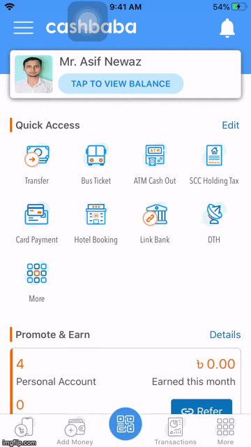

&nbsp;&nbsp;&nbsp;&nbsp;&nbsp;&nbsp;&nbsp;&nbsp;&nbsp;&nbsp;&nbsp;&nbsp;

# About Me:
𝗪𝗵𝗮𝘁 𝗮𝗻𝗱 𝗵𝗼𝘄 𝗰𝗮𝗻 𝗜 𝗰𝗼𝗻𝘁𝗿𝗶𝗯𝘂𝘁𝗲 𝘁𝗼 𝘆𝗼𝘂𝗿 𝗰𝗼𝗺𝗽𝗮𝗻𝘆...
* Develop and maintain iOS product from planning to production
* Refactor legacy/monolithic codebase to modern
* Make the app high-performant
* Lead a mid-small size iOS team

𝗜 𝗮𝗺...
* An iOS Software engineer with 4+ years of professional experience, specializing in developing iOS apps,
* An avid learner, who has built over 8 iOS/iPad applications.
* Continuously delivering high-performant iOS app with attention to detail.
* Additional hands-on experience in Android, Java, Flutter, and C#.

𝗠𝘆 𝘀𝘁𝗿𝗼𝗻𝗴𝗲𝘀𝘁 𝘀𝗸𝗶𝗹𝗹𝘀...
* 𝘔𝘢𝘪𝘯 𝘦𝘹𝘱𝘦𝘳𝘵𝘪𝘴𝘦 𝘰𝘯 𝘪𝘖𝘚, 𝘚𝘸𝘪𝘧𝘵, 𝘚𝘸𝘪𝘧𝘵UI, 𝘖𝘣𝘫𝘦𝘤𝘵𝘪𝘷𝘦-𝘊
* 𝘈𝘣𝘪𝘭𝘪𝘵𝘺 𝘵𝘰 𝘮𝘢𝘯𝘢𝘨𝘦 𝘢 𝘵𝘦𝘢𝘮 𝘢𝘯𝘥 𝘱𝘳𝘰𝘥𝘶𝘤𝘵
* 𝘈𝘭𝘨𝘰𝘳𝘪𝘵𝘩𝘮 𝘢𝘯𝘥 𝘱𝘳𝘰𝘣𝘭𝘦𝘮-𝘴𝘰𝘭𝘷𝘪𝘯𝘨 𝘢𝘣𝘪𝘭𝘪𝘵𝘺

𝗔𝗿𝗲𝗮𝘀 𝗼𝗳 𝗲𝘅𝗽𝗲𝗿𝘁𝗶𝘀𝗲 𝗶𝗻𝗰𝗹𝘂𝗱𝗲...
* 𝘚𝘰𝘧𝘵𝘸𝘢𝘳𝘦 𝘦𝘯𝘨𝘪𝘯𝘦𝘦𝘳𝘪𝘯𝘨 : OOP, MVC, MVP, MVVM, VIPER, Design Pattern, Redux, SOLID, Scrum, Git, JIRA
* 𝘊𝘰𝘳𝘦 𝘋𝘦𝘷𝘦𝘭𝘰𝘱𝘮𝘦𝘯𝘵 : Xcode, iOS, Objective C, Swift, SwiftUI, Java, C#, RESTful JSON APIs, Combine, Reactive programming, Dependency injection, CocoaPods
* 𝘛𝘦𝘤𝘩𝘯𝘰𝘭𝘰𝘨𝘺 𝘋𝘰𝘮𝘢𝘪𝘯 : CBS, eWallet, MFS, Utility apps, E-Commerce apps, Real-time Communication apps.

# Major iOS Portfolio:
# [CashBaba](https://apps.apple.com/us/app/cashbaba-bd/id1352887969)
CashBaba e-wallet enables you to move Cashless. It can manage all your bank accounts and credit cards in your mobile and can process payments anywhere at anytime. It provides a simple and reliable way to manage your money on the go at low cost. 

I'm extremely pleased with how the project came out. I'm particularly proud of the app's animation, UI design, and easily-extended architecture (MVVM). CashBaba is built with Xcode and written entirely in Swift 5. It utilizes Auto Layout for UI design. CashBaba is my ongoing project.

### My Role ###
Design, develop, understanding requirements and sprint planning.

### Technologies ###
* Swift(4-5)
* CoreData
* CoreLocation
* AVFoundation
* Photos
* Push Notifications
* Alamofire
* Firebase
* Face id and thumb Sign in enabled

# [Yes Halal](https://apps.apple.com/us/app/yes-halal/id1478596967?ls=1)
The Ultimate Muslim Lifestyle App.
Explore Your Muslim Lifestyle – Socialize, Eat, Play and Pray with SALAM PLANET!

This application consists of best animationts with *UIDynamicAnimator*, UI design, and easily-extended architecture (*MVVM*)  and *ML kit* for **OCR**. Yes Halal is built with Xcode and written entirely in swift. It utilizes Auto Layout with Storyboard for UI design.This app convert image news to Text and then Text to that news URL to post it in the application.

### My Role ###
Design, develop, understanding requirements and sprint planning.

### Technologies ###
* Swift
* Scan Barcode
* CoreLocation
* AVFoundation
* Photos
* Push Notifications
* Local Notificatios
* Firebase Firestore
* GoogleSignIn
* FBSDKLoginKit 
* Google Map
* Namaz Time, Quibla Direction
* 3D touch enabled 
* AFNetworking

## Contributions/Link 
*  [linkedin](https://www.linkedin.com/in/measifnewaz/)    
*  [Stackoverflow](https://stackoverflow.com/story/asifnewaz)
*  [Hackerrank](https://www.hackerrank.com/measifnewaz)

